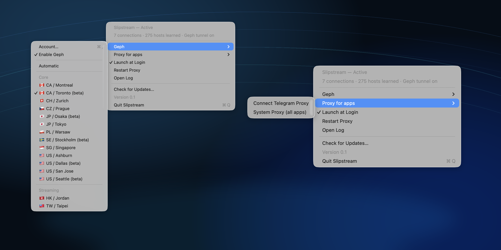

# Slipstream

<div align="center">

**Русский** · [English](README.en.md)

[-000000?logo=apple)](#установка)
[](#платформы)
[](LICENSE)
[](https://github.com/aiwaki/slipstream/actions/workflows/build-geph.yml)
[](https://github.com/aiwaki/slipstream/actions/workflows/build-app.yml)

</div>

Slipstream — кроссплатформенный клиент умной маршрутизации для заблокированных
и замедленных сервисов. Он держит интернет доступным без полного VPN для всего
трафика: где можно — идёт напрямую, где нужно — включает локальный обход DPI,
а гео-заблокированные сервисы отправляет через выбранный выход Geph.

Маршрут выбирается автоматически:

- российские сервисы идут напрямую;
- трафик, который ломает DPI, обходится локально;
- сервисы, которым нужен зарубежный IP, идут через Geph;
- отдельные приложения, например Telegram Desktop, могут использовать встроенный прокси.

Без расширений, без ручной настройки прокси в каждом приложении, без лишнего
удалённого туннеля для всего подряд.

> [!NOTE]
> Сейчас доступна ранняя сборка для macOS Apple Silicon, настроенная под сети РФ.
> Windows, Linux, iOS и Android — в дорожной карте; набор обходов будет зависеть
> от возможностей каждой платформы.

## Интерфейс macOS-сборки

<p align="center">
  
</p>

## Что чинит

| Сервис | Как идёт |
|---|---|
| Discord | чат, серверы и голос через локальный десинк |
| YouTube | локально, без бесконечных подгрузок |
| ChatGPT и Claude | только они уходят через зарубежный выход Geph |
| Telegram Desktop | через встроенный MTProto-over-WebSocket прокси |
| Остальное заблокированное или замедленное | автоматически выбирается локальный обход или туннель |

## Чем отличается от обычного VPN

Slipstream не пытается заменить весь интернет одним удалённым VPN-сервером.
Он делит трафик и выбирает самый лёгкий рабочий маршрут:

| Трафик | Куда идёт | Почему |
|---|---|---|
| Российские сервисы | напрямую | банки, госуслуги и местные сайты не видят заграничный айпи |
| То, что ломает DPI | локально через десинк | айпи остаётся русским, задержка минимальная |
| То, что не пускает русские айпи | через Geph | зарубежный выход нужен только там, где иначе никак |

Быстро, где можно. В обход — только где иначе никак.

На iOS и Android системно это может выглядеть как VPN-профиль, но цель остаётся
той же: split-routing, а не постоянный удалённый туннель для всего устройства.

## Как устроено

| Слой | Роль | Платформенность |
|---|---|---|
| Маршрутизатор | решает, куда отправить домен или соединение | общая логика |
| Локальный обход | обходит DPI там, где ОС это позволяет | адаптер под платформу |
| Туннель Geph | даёт зарубежный выход для гео-блокировок | общий сетевой слой |
| Адаптеры приложений | подключают меню, системный роутинг и прокси для приложений | зависит от ОС |

<details>
<summary>Схема текущей macOS-сборки</summary>

```
                 ┌─────────────────────────── твой Mac ───────────────────────────┐
   любая         │  прозрачный перехват :443 (pf)                                  │
   программа ──► │        │                                                        │
   (браузер,     │        ├─ российский хост? → напрямую, не трогаем               │
   Discord,      │        ├─ ломают по DPI?   → 1) ДЕСИНК (локально, на месте)     │
   Claude…)      │        └─ режут по гео?    → 2) ТУННЕЛЬ GEPH (выход за границей) │
                 │  Telegram Desktop ───────► 3) TG-WS-ПРОКСИ (локальный MTProto)   │
                 └────────────────────────────────────────────────────────────────┘
```

</details>

В текущей macOS-сборке это собрано из трёх частей:

1. **Десинк** — локально дурит DPI-фильтр: режет TLS-хендшейк на куски и кидает
   пакеты-обманки с коротким TTL (идея из zapret / byedpi), плюс DoH против
   подмены DNS и отдельная дорожка под голос Discord. Айпи не трогает вообще.
2. **Geph** — это VPN; мы взяли его за цену/качество (открытый, [geph.io](https://geph.io),
   внутри `geph5-client`). Выводит за границу **только** то, что режут по гео.
   Страну выбираешь сам.
3. **tg-ws-proxy** — локальный прокси ([Flowseal](https://github.com/Flowseal/tg-ws-proxy)),
   гонит Telegram по вебсокету мимо блокировки IP дата-центров.

Десинк и Telegram-прокси — целиком у тебя на машине. Geph — готовая сеть, тебе
нужен в ней только аккаунт.

## Платформы

| Платформа | Статус |
|---|---|
| macOS Apple Silicon | ранняя предварительная сборка |
| Windows | планируется |
| Linux | планируется |
| iOS | планируется, с учётом ограничений Network Extension |
| Android | планируется, через платформенный VPN-слой со split-routing |

## Установка

1. Скачай `Slipstream.app` из [релизов](https://github.com/aiwaki/slipstream/releases) и кинь в «Программы».
2. Запусти. Один раз спросит пароль — чтобы поставить фоновую службу. Дальше делает всё сам.
3. В меню (иконка в строке меню):
   - **Geph → Account…** — вставь ключ своего аккаунта Geph (бесплатного хватает).
   - **Geph → выбери выход** — город или **Automatic**.
   - **Connect Telegram Proxy** — направит Telegram на встроенный прокси.

Готово — дальше оно само.

> [!TIP]
> Первая сборка пока не нотарифицирована Apple. Если macOS ругается на скачанное
> приложение, открой его через правый клик → **Open**.

## Собрать самому

Нужны Rust, Node, Python 3 и Xcode command-line tools.

```bash
# фоновая служба, которую приложение кладёт внутрь .app
cd spike
./build_daemon.sh
cd ..
rm -rf app-tauri/src-tauri/slipstreamd
cp -R spike/dist/slipstreamd app-tauri/src-tauri/slipstreamd

# приложение в строке меню
cd app-tauri
npm ci
# для чистого локального релиз-билда нужен geph sidecar:
# app-tauri/src-tauri/binaries/geph5-client-aarch64-apple-darwin
npm run tauri build

# фоновая служба (десинк + роутинг) — приложение ставит её само,
# но при разработке можно вручную из корня репозитория:
cd ..
sudo python3 spike/tproxy.py --install
```

Встроенный `geph5-client` собирается из исходников прямо в CI
([`build-geph.yml`](.github/workflows/build-geph.yml)) — всегда свежий, без
протухших бинарников. CI сам кладёт его в `app-tauri/src-tauri/binaries/`.

## Что где

| Путь | Что это |
|------|---------|
| `app-tauri/` | Текущая macOS-сборка: приложение в строке меню (Tauri + Rust). |
| `spike/tproxy.py` | Служба десинка и раздельного роутинга для macOS-сборки (Python, root). |
| `vendor/tg-ws-proxy/` | Встроенный Telegram-прокси MTProto-over-WebSocket. |
| `vendor/geph/` | Как собирается и обновляется встроенный `geph5-client`. |
| `docs/` | Заметки по устройству и безопасности. |

## Приватность

- Клиентская логика Slipstream работает локально на твоём устройстве.
- Российские сервисы держим **в стороне** от туннеля — идут напрямую, например банк не видит заграничный айпи.
- Geph — твой аккаунт в открытой сети Geph; за её безопасность отвечают они, подробности — в их доках.

## Благодарности

- **Slipstream** — [MIT](LICENSE).
- **geph5-client** — MPL-2.0, © [Geph](https://geph.io). Встроен как есть, собирается в CI.
- **tg-ws-proxy** — MIT, © [Flowseal](https://github.com/Flowseal/tg-ws-proxy). Встроен как модуль.
