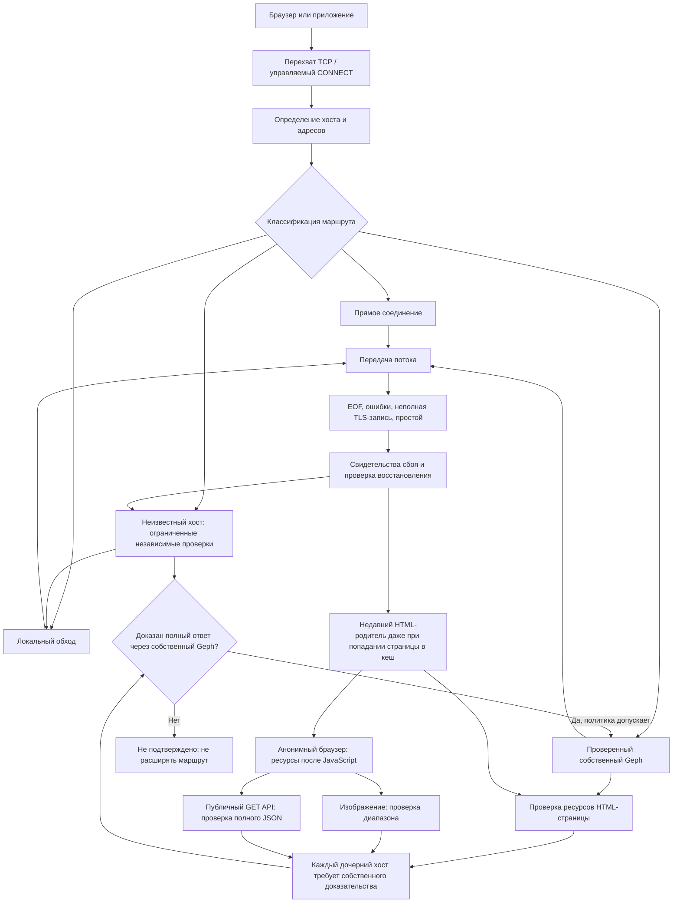

# Карта диагностики Slipstream

Базовая карта проверена по исходникам `cb8f093` (2026-09-28); раздел API
дополнен по `f4251985` (2026-09-30), границы гонок — по аудиту поверх
`dcf4bcb0` (2026-10-01). Это карта реализации,
а не утверждение, что все ветви успешно работают в установленном приложении.
Текущая установка и незакрытые проверки — в [CURRENT_STATE.md](CURRENT_STATE.md).
Политика — в [DECISIONS.md](DECISIONS.md), системные границы — в
[ARCHITECTURE.md](ARCHITECTURE.md).

## Путь запроса

Это схема TCP/HTTPS. Голосовой UDP, DNS и жизненный цикл службы имеют отдельные
проверки; успех этой схемы не доказывает работу звонка. Discord и YouTube остаются
на локальном обходе. Маршрут родителя не даёт разрешения направлять его CDN/API
через Geph.

## От симптома к коду и доказательству

Символы указаны явно: номера строк меняются. Открывайте связанный файл и ищите
имя символа. Для переходов между вызовами используйте граф именно этого checkout.

| Симптом / граница | Код и символ | Что сопоставить | Критерий успеха |
|---|---|---|---|
| Долго нет первого ответа | [tproxy.py](../spike/tproxy.py): `resolve_connection_ips`, `_run_initial_route_preflight`, `_run_unknown_initial_route_race` | DNS-адрес, выбранный маршрут, длительность каждого этапа, причина отказа | Нужный документ получен полностью; один TCP connect недостаточен |
| HTML открылся частично, стили отсутствуют | [tproxy.py](../spike/tproxy.py): `_semantic_geph_root_response`, `_incomplete_response_geph_payload_probe`, `relay_local_stream` | Фактический и объявленный размер ответа, редирект, EOF; сравнение одного объекта на разных маршрутах | Полный документ после редиректа и полный CSS; браузер применил стили |
| Главная работает, картинки нет | [tproxy.py](../spike/tproxy.py): `_check_learned_parent_assets`, `_discover_dynamic_parent_asset`; [browser_probe.rs](../app-tauri/src-tauri/src/browser_probe.rs) | Есть ли объект в исходном HTML или только после JS; независимые доказательства именно дочернего хоста | Изображение полностью скачано и декодировано в браузере, `naturalWidth > 0` |
| После кеширования страницы восстановление не запускается | [tproxy.py](../spike/tproxy.py): `note_partial_tls_stall`, `_remember_recent_asset_parent`, `_schedule_recent_parent_asset_recovery` | Свежая ошибка дочернего хоста, недавний подтверждённый родитель; новый хост не ждёт cooldown статической проверки, повторный сохраняет паузу; собственная задача восстановления | Восстановление запускается без нового соединения родителя; следующий запрос ресурса успешен |
| На первом открытии ошибка картинки не запускает восстановление | [tproxy.py](../spike/tproxy.py): `_run_initial_route_preflight`, `_remember_recent_asset_parent` | После полного подтверждения родителя и обнаружения HTML-ресурсов зарегистрирована связь с родителем; повторное соединение родителя не требуется | [test_owned_parent_assets.py](../spike/test_owned_parent_assets.py): `test_first_proven_navigation_can_schedule_later_child_recovery`; отдельно реальное первое открытие |
| Корень CDN успешен, но первый запрос картинки успевает уйти по сломанному маршруту | [tproxy.py](../spike/tproxy.py): `_wait_for_pending_bootstrap_children`, `_run_initial_route_preflight` | Сравнить время начала корневого запроса, появления дочерней проверки и её фиксации; проверка могла появиться во время ожидания корня | [test_pending_child_join.py](../spike/test_pending_child_join.py): `test_child_started_during_root_probe_is_joined_before_release`; затем картинка декодирована без ручной перезагрузки |
| Картинки появились, данные страницы всё ещё нет | [bootstrap_asset_preflight.py](../spike/bootstrap_asset_preflight.py), [route_preflight.py](../spike/route_preflight.py), [browser_probe.rs](../app-tauri/src-tauri/src/browser_probe.rs) | Отдельно XHR/fetch/API: статус, полнота ответа, ошибка консоли | Полный нужный ответ API и заполненный интерфейс. Успех image-discovery не закрывает этот пункт |
| Видео/поток/чат работал и завис | [tproxy.py](../spike/tproxy.py): `relay_local_stream`, `_watch_partial_tls_record`, `_watch_downstream_idle` | Последние байты обоих направлений, framing, причина окончания relay; время клиентского reconnect | Длительный полезный обмен и восстановление после контролируемого сбоя. Тишина сама по себе не доказывает обрыв |
| Собственный Geph недоступен или сменился | [tproxy.py](../spike/tproxy.py): `geph_listener_owned`, `_geph_live`, `request_owned_geph_restart`, `_coalesced_owned_geph_recovery_for_replay` | Владелец listener, поколение процесса, активные сессии, готовность полезного ответа | Подтверждённый собственный backend и полный payload, а не только открытый SOCKS-порт |
| Codex пишет Reconnecting | Клиент Codex + вышеперечисленные relay/backend-функции | Раздельно `codex_core::responses_retry` (ответ модели), remote-control WebSocket, usage/pubsub; затем сопоставить время с daemon | Поток модели завершается; исчезновение одного служебного предупреждения недостаточно |
| После обновления поведение старое / Quit завис | [tproxy.py](../spike/tproxy.py): `serve_until_shutdown`, `_cancel_recent_parent_asset_recovery`, `_bootout_installed_launchd_job`; [verify_macos_app_bundle.py](../scripts/verify_macos_app_bundle.py) | Drain worker, отсутствие принадлежащей службы, точный installed source и свежий StatusV2 | Канонический verifier PASS плюс нормальные запуск/Quit и реальный браузер |

## Почему одного графа недостаточно

### Дополнительные границы отмены и владения (аудит 2026-10-01)

| Наблюдение | Что проверить в коде | Регрессионное доказательство |
|---|---|---|
| Восстановление ресурса так и не началось после занятости проверки | `tproxy.py`: очередь recent-parent recovery, execution lease и identity task | `test_dynamic_asset_discovery.py`: ожидание общей ёмкости, отмена до первого шага; выбранный объект не охлаждает все оставшиеся хосты |
| После отмены запросов маршрут надолго остаётся недоступным | `RouteCircuitRegistry` и runtime permits в `tproxy.py`: владелец, epoch, TTL | `test_runtime_circuit_permits.py`: отмена, поздний/чужой/повторный результат, eviction и частичный HALF_OPEN success |
| Отмена одной вкладки влияет на другие запросы | Общие DNS/Geph futures: кто владеет worker, а кто только ждёт | `test_shared_network_cancellation.py`: отмена waiter не отменяет общий результат и не освобождает слот работающего worker |
| SOCKS или диагностика Geph зависает при открытом порте | Общий deadline всех полей ответа, ограничение control reply, закрытие сокета | `test_geph_io_deadlines.py`; для app-owned DoH — `test_doh_runtime_deadline.py` |
| Анонимный браузер не передал доказательство при живом CDP | `browser_probe.rs::websocket_read_json`: незавершённое сообщение между idle polls | Фрагмент через паузу 400 ms сохраняется; незавершённое сообщение по общему deadline завершается ошибкой |
| Вкладка неожиданно обновляется после перехода на другую страницу того же сайта | Companion: идентичность навигации до/после native reply | JS tests для Chrome/Safari: старый ответ не обновляет новую навигацию; MV3 restart сохраняет допустимый сигнал из session storage |
| Quit, запуск или обновление оставляет старое состояние | IPC server/task cleanup; coordinator watermark; updater flock; atomic staging | IPC cancellation tests, Rust lifecycle/updater tests, параллельные build-stage fixtures |
| Выход зависает на живом соединении или обрывает его раньше grace | `serve_until_shutdown`, `handle`; порядок PF teardown, запрета новых потоков, drain/cancel и `Server.close` | `test_probe_shutdown_order.py`: реальные TCP streams и обе семантики Python 3.13; тестовый PF всегда подменён |
| Перезапуск Telegram-слушателя не завершается | `_run` в `vendor/tg-ws-proxy/proxy/tg_ws_proxy.py`: клиенты должны закрыться до ожидания listener task | `test_telegram_transport_lifecycle.py`: настоящий loopback, stop/cancel/restart без зависимости от неявного `close_clients` |
| Закрытый внутренний broker оставляет socket или старый результат | Owned IPC server, coalesced close, принадлежность client tasks и допуск эффекта конкретному владельцу | `test_owned_ipc_shutdown.py`: настоящие Unix sockets, отмена до первого шага, повторная отмена и запоздавший результат |

Подробные причины, RED/GREEN и пределы покрытия записаны в
[журнале аудита](CODEBASE_AUDIT_2026-09-05.md#2026-10-01-повторный-аудит-багов-и-гонок).
Эти тесты доказывают классы дефектов в исходниках. Без совпадения времени,
маршрута и причины завершения они не объясняют автоматически каждый живой
`reconnecting`. Состояние установленной сборки проверяется отдельно.

Статический граф показывает, где принимается решение. Для случайного обрыва
нужна временная шкала: **время → хост → выбранный маршрут → этап → причина
завершения → действие восстановления → результат повторного запроса**.

1. Зафиксировать время сбоя с часовым поясом и реальное действие пользователя.
2. Проверить установленную версию: из `app-tauri` выполнить
   `npm run verify:local-install`. Это проверка установки и контрольного трафика,
   не всех сайтов.
3. Сопоставить ошибку клиента и daemon в одном часовом поясе. У Codex журналы
   обычно содержат UTC; не сравнивать их строки с локальным временем напрямую.
4. Проверить именно сломавшийся объект, а не `/` его домена. Для приватного API
   не переносить токены, cookies и содержимое запросов в диагностические артефакты.
5. Воспроизвести класс ошибки тестом; затем проверить реальный браузер/приложение.
   Фокус окна не должен быть условием исправности передачи трафика.

Для временной шкалы лучше использовать экспорт фиксированных полей, а не копию
всего журнала: сырые логи могут содержать URL, подписи, идентификаторы и данные
авторизации. Совпадение времени — повод проверить причинную связь, не её доказательство.

## Что уже проверяется, а что остаётся открытым

- [test_dynamic_asset_discovery.py](../spike/test_dynamic_asset_discovery.py):
  границы анонимного обнаружения изображений, кандидаты, кешированный родитель,
  отмена задач при shutdown.
- [test_partial_recheck_lifetime.py](../spike/test_partial_recheck_lifetime.py):
  срок жизни свидетельств неполной передачи и повторной проверки.
- [test_terminal_partial_tls.py](../spike/test_terminal_partial_tls.py):
  терминальное неполное TLS-сообщение.
- V3 обнаруживает анонимное изображение. Это **не универсальное обнаружение
  произвольных авторизованных XHR/JSON-запросов**.
- На TestGlider картинки были подтверждены отдельно; ошибки lessons API
  `ERR_CONTENT_LENGTH_MISMATCH` и blog XHR остаются незакрытыми в текущих
  доказательствах. Полный внешний вид главной страницы этого не опровергает.
- Новый маршрут не возобновляет уже оборванную TLS-сессию. Клиенту нужен новый
  запрос; автоматический повтор произвольного запроса может быть небезопасен.
- Последний CI lifecycle сначала упал на drain/cleanup worker, повтор прошёл.
  Зелёный повтор не устанавливает причину первоначальной гонки.
- Нельзя доказать отсутствие будущих отказов на всех сайтах. Можно закрывать
  конкретные классы отказов регрессионными тестами и наблюдаемыми критериями.

## Пример сопоставления: Codex, 2026-09-28

| UTC в Codex | Локальное время +05:00 | Slipstream для `chatgpt.com` |
|---|---|---|
| 14:28:36 | 19:28:36 | `stage=geph reason=upstream_eof` |
| 14:29:54 | 19:29:54 | `stage=geph reason=upstream_reset` |
| 14:31:40 | 19:31:40 | `stage=geph reason=upstream_eof` |
| 14:52:03 | 19:52:03 | `stage=geph reason=upstream_eof` |
| 14:55:52 | 19:55:52 | `stage=geph reason=upstream_eof` |

Во всех этих точках Codex `responses_retry` зарегистрировал обрыв потока ответа.
Это локализует наблюдаемый сбой до upstream на маршруте Geph; не позволяет
различить сам backend, его выход, промежуточную сеть и удалённый сервер.
`recovery=not_attempted` описывает эту relay-сессию, а не отсутствие любых
последующих попыток приложения. После запуска новой сборки в 20:28–20:34
встречаются новые EOF/reset и ошибки SOCKS, а в 20:30:16 — перезапуск собственного
Geph. Следовательно, замену приложения нельзя считать исправлением reconnects.
Сырые журналы оставлены локально в `output/reconnecting-20260928/`.

### Установленная причина общего сброса сессии Geph

В точной версии Geph0.3.9 функция `open_tunnel_on_session` при тайм-ауте
ответа на открытие нового туннеля выставляет `session.early_dead`.
`proxy_loop` получает этот сигнал и прекращает всю мультиплексированную сессию,
включая другие уже установленные туннели. Журнал встроенного Geph содержит
`timeout waiting for tunnel open response` → `dying due to an early-dead signal`.

Регрессия с двумя потоками воспроизводит проблему без Интернета: новый туннель
не отвечает, существующий должен оставаться пригодным для передачи. Тест падает
на upstream0.3.9 и проходит с правкой. В r3 убрано только выставление общего
сигнала при этом тайм-ауте; сам10-секундный тайм-аут и обработка действительной
смерти mux сохранены. Точный diff и тест находятся в
[SOURCE.json](../vendor/geph/SOURCE.json), опубликованном вместе с исходным
контрактом. Статус установки и живой проверки — в CURRENT_STATE.md.

Это подтверждает один механизм массовых обрывов, но не доказывает, что каждый
EOF в журнале вызван именно им или что внешняя сеть больше не может оборваться.

### Проверка после установки Geph r3, 2026-09-28

Установлена сборка `6673f92`; каноническая проверка установленного приложения и
полных PNG по трём маршрутам прошла. В живом журнале пять тайм-аутов открытия
туннеля (17:23:50–57 UTC) больше не вызвали `early-dead` общей сессии. Это
подтверждает устранение каскадного обрыва при этом конкретном отказе.

Однако в 17:23:45 UTC Codex зарегистрировал `error sending request`. Ранее,
в 17:22:08 UTC, Geph не смог разобрать свежий ответ брокера и использовал
сохранённый маршрут. Связь этих двух событий пока не доказана. Ошибки открытия
нового соединения нужно исследовать отдельно от обрыва уже работающего потока;
успешная проверка PNG не подтверждает исправление всех API/XHR и стримов.

### Пауза Geph переключала следующие запросы на системный маршрут

В журнале 2026-09-28 ошибка SOCKS для `chatgpt.com` в22:23:44+0500
сопровождается последующими `stage=system_plain` и EOF/write_error. В
`_handle_impl` защита от такого перехода распространялась на выученные хосты,
но не на встроенный список geo-exit. Регрессионные проверки для `chatgpt.com`
воспроизвели переход при cooldown и недоступном backend.

Исправление458d710 сохраняет выбор включённого встроенного Geph во всех этих
состояниях. Готовый принадлежащий приложению listener может проверить первые
байты в прежний срок; drain и circuit продолжают действовать. Если проверка
невозможна, незавершённое соединение закрывается без отправки напрямую.
Явное отключение Geph и внешний системный маршрут остаются отдельными режимами.
Проверки:41 тест обработчика и36 контрактов, включая полноценную передачу
ответа при cooldown. Это не доказательство доступности внешнего exit в любой
момент и не восстановление уже оборванного зашифрованного потока.

### Одновременный сбой Steam и Codex, 2026-09-29/30

Steam `cef_log.txt` в18:09:04+05:00 сообщает TLS `net_error -100`;
в ту же секунду daemon сообщает `store.steampowered.com: SOCKS connect failed`.
Для `chatgpt.com` upstream reset зарегистрирован в18:07:20 и18:08:40.
Отказы начинаются до перезапусков Geph18:07:31/18:08:03, поэтому установка
или перезапуск не объясняют всю последовательность.

Разделяйте две границы:

| Граница | Контроль | Что установлено |
|---|---|---|
| Открытие туннеля | Тот же публичный хост через собственный SOCKS9954, минуя tproxy | TestGlider завершился curl97 через10.007s до TLS; сбой воспроизводится внутри пути Geph |
| Уже открытый поток | Сопоставление upstream EOF/reset с клиентским reconnect | Осталось открытым: успешное новое соединение не доказывает устойчивость существующего |

В установленном r3 `session.rs::open_conn` ждёт одну выбранную сессию.
Кандидат r4 в PR381 добавляет `open_tunnel_with_reserve` и
`select_session_excluding`: после350ms либо отказа первой попытки пробует одну
другую сессию, сохраняя общий10s срок. Реальные PicoMux-тесты проверяют успешный
резерв при зависшей основной сессии и успешную основную при отказе резерва;
существующий поток остаётся рабочим. Это проверка класса ошибки, пока не
подтверждение исправности установленного приложения. При принятии r4 убрать
внешний `_open_owned_geph_with_reserve`, чтобы попытки не перемножались.

### Ошибка одного нового потока завершает общую сессию, 2026-09-30

В r3/r4 тайм-аут открытия уже изолирован, но ошибки чтения ответа (в том числе
EOF) и разбора JSON в `open_tunnel_on_session` всё ещё выставляют `early_dead`.
В `proxy_loop` этот сигнал завершает общую сессию. Это отдельный путь от
тайм-аута; исправление тайм-аута само по себе его не закрывает.

| Проверка | Доказательство | Ограничение |
|---|---|---|
| Закрыть один новый поток при живом соседнем | Реальный PicoMux-тест падает на r4: mux жив, early_dead выставлен | Воспроизводит механизм, а не конкретный пользовательский эпизод |
| EOF и неверный JSON после исправления r5 | Ошибка возвращается вызывающему; счётчик открытий обнулён; соседний поток передаёт данные | Не доказывает восстановление всех сайтов |
| Ошибка в установленной версии | В журнале Geph отмечены ошибки чтения ответа 2026-09-30 14:20:23 и14:23:39 UTC | Нужна корреляция с потерянными соединениями, прежде чем приписывать ей Steam/Codex |

PR382 убирает только два ошибочных общих сигнала. Настоящая смерть mux
по-прежнему завершает `proxy_loop`; ошибка выделения mux-потока сохраняет
прежнюю обработку. До установки и проверки приложения считать сбой открытым.

### Картинки появились, но данные API не загрузились

`ERR_CONTENT_LENGTH_MISMATCH` при HTTP200 означает, что нужно проверить полноту
конкретного ответа. Корень API `/` и HTML родительской страницы эту проверку
не заменяют.

| Этап | Код | Что проверять |
|---|---|---|
| Обнаружение анонимного GET после загрузки страницы | `browser_probe.rs::AnonymousGetDiscovery` | Совпадают ID запроса, URL и выбранный хост; метод GET, ответ HTTP200 JSON. Пользовательский профиль не используется. |
| Передача подсказки процессу daemon | `route_preflight.py::parse_route_preflight_result_v4` | Тип ресурса, хост, одноразовая capability и исходный срок действия. URL не становится правилом маршрутизации. |
| Полнота и совпадение объекта | `bootstrap_asset_preflight.py::inspect_public_json_response` | Фактический размер совпадает с Content-Length; полный ответ содержит JSON-объект или массив; сравнение привязано к длине и ETag либо хешу префикса. |
| Выбор маршрута | `tproxy.py::_bootstrap_asset_preflight_blocking` | Независимо проверены системный путь, DNS приложения и локальные стратегии. Полный локальный ответ запрещает переход на Geph. |
| Проверка результата | Реальный браузер | Завершились тела API-ответов, появились нужные данные и изображения. HTTP200 и загрузки HTML недостаточно. |

Подсказка браузера или полный ответ через Geph сами по себе не разрешают новый
маршрут. Сжатые ответы, chunked-передача, API с авторизацией и JSON больше лимита
проверки остаются неподтверждёнными; их нельзя записывать в исправленные.
